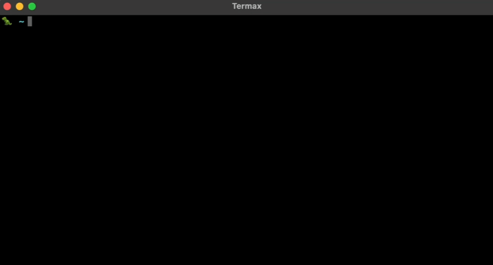
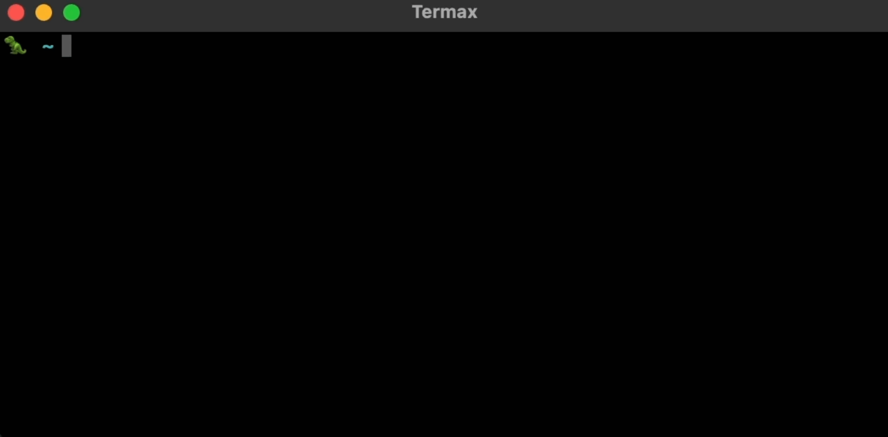

# Termax

  [](https://pepy.tech/project/termax) 


Similar to GitHub [Copilot CLI](https://docs.github.com/en/copilot/github-copilot-in-the-cli/about-github-copilot-in-the-cli), Termax is a personal AI assistant in your terminal.

<br/>
<p align="center"> 

It is featured by:

- 🍼 Personalized Experience: Optimize the command generation with RAG.
- 📐 Various LLMs Support: OpenAI GPT, Anthropic Claude, Google Gemini, Mistral AI, Ollama, and more.
- 🧩 Shell Extensions: Plugin with popular shells like `zsh`, `bash` and `fish`.
- 🕹 Cross Platform: Able to run on Windows, macOS, and Linux.

## Installation

```bash
pip install termax
```

## Quick Start

> [!TIP]
> * After installation, you'll need to configure the LLM (e.g., set the [OpenAI API key](https://beta.openai.com/account/api-keys)).
> * A setup guide will automatically launch the first time you use Termax. 
> * Alternatively, you can manually initiate configuration at any time by running `t config` or `termax config`.
> * Please read ℹ️ and warnings under each feature before using to ensure your data safety.


### Ask Commands

You can start using Termax by asking using command `t` or `termax`, for example:

```bash
t show me the top-5 CPU processes
```

You can also use Termax to control your software:

```bash
t play a song using Spotify
```

Here is a more complex example:



ℹ️ **Note:** Be aware of privacy implications. This feature collects the following info into LLM prompt.
- **System Info:** os, hardware architecture
- **Path Info:** username, current directory, file names in directory


### Guess Commands

Termax can generate a command suggestion like Github Copilot CLI:

```bash
t guess
```


## Shell Plugin

We support various shells like `bash`, `zsh`, and `fish`. You can choose to install the plugins by:

```bash
t install -n <plugin>
```

The `<plugin>` can be any of `zsh`, `bash`, or `fish`. With this plugin, you can directly convert natural language into
commands using the `Ctrl + K` shortcut.



You can also easily uninstall the plugin by:

```bash
t uninstall -n <plugin>
```

Remember to source your shell or restart it after installing or uninstalling plugins to apply changes.

## Configuration

Termax has a global configuration file that you can customize by editing it. Below is an example of setting up Termax with OpenAI:

```
[general]                  # general configuration
platform = openai          # default platform
auto_execute = False       # execute the generated commands automatically
show_command = True        # show the generated command
storage_size = 2000        # the command history's size, default is 2000

[openai]                   # platform-related configuration
model = gpt-3.5-turbo      # LLM model
api_key = <your API key>   # API key
temperature = 0.7
save = False
```

> [!TIP]
> * The configuration file is stored at `<HOME>/.termax`, so as the vector database.
> * For other LLMs than OpenAI, you need to install the client manually.
> * We utilize [ChromaDB](trychroma.com) as the vector database. When using OpenAI, Termax calculates embeddings with OpenAI's `text-embedding-ada-002`. For other cases, we default to Chroma's built-in model.

## Retrieval-Augmented Generation (RAG)

Our system utilizes a straightforward Retrieve and Generate (RAG) approach to enhance user experience continuously. Each time the command generation feature is used, Termax captures and stores a "successful example" in a local vector database. This "successful example" comprises the command that was successfully executed without errors, along with the user's description that prompted this command. These entries serve as valuable references for future command generations based on similar user descriptions.

<br/>
<p align="center"> 

Additionally, we gather external information crucial for effective prompting engineering. This includes system details such as the operating system version and the structure of files in the current workspace. This data is essential for generating precise commands that are compatible with the user's current system environment and are pertinent to file management operations.

## Contributing

For developers, you can install from source code to enable the latest features and bug fixes.

```bash:
cd <root of this project>
pip install -e .
```

We are using [PEP8](https://peps.python.org/pep-0008/) as our coding standard, please read and follow it in case there
are CI errors.

## License

Licensed under the [Apache License, Version 2.0](LICENSE).


